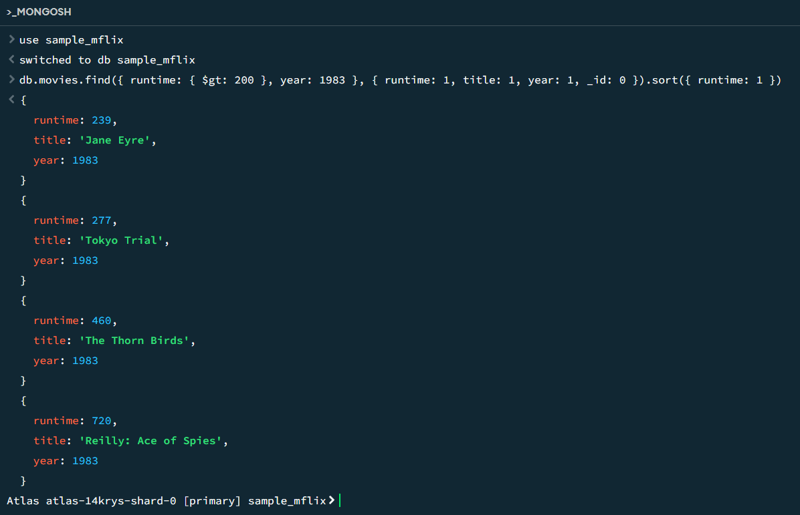
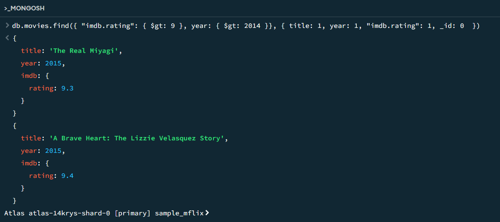

# Assignment-3-MongoDB-Setup-and-Queries
Assignment 3: MongoDB Setup and Queries

For this assignment I used MongoDB compass and mongosh terminal to create and run the two queries shown below. Both queries use the sample_mflix database. The first query finds and lists all movies with a runtime greater than 200 minutes that were released in 1983, sorted by runtime increasing. The second query finds and lists all movies after the year 2014 that have a imdb rating greater than 9.

